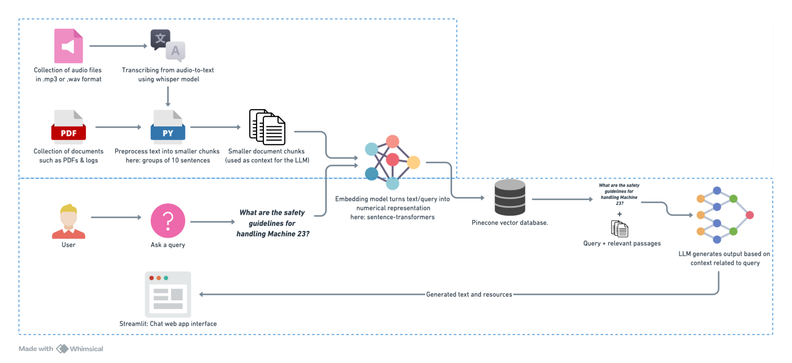

# Step-by-Step Guide for Building the RAG Pipeline

**Parikshith Palegar**  
Email: [palegar.parikshith@gmail.com](mailto:palegar.parikshith@gmail.com)  
Phone: +91 9113681724

## Overview
This document outlines the design of a Retrieval-Augmented Generation (RAG) system tailored for a Manufacturing Execution System (MES) in the chemical industry. The goal is to create a robust architecture that integrates diverse data sources, including text documents, video transcripts, logs, FAQs, and user guides, to build a comprehensive knowledge base. The system will leverage Gen-AI techniques to provide precise, contextually relevant answers to user queries.

The architecture covers the entire pipeline, from data ingestion and preprocessing to query handling and response generation. It aims to streamline information retrieval for MES users, enhancing decision-making and operational efficiency through intelligent, context-aware assistance.



## 1. Data Preprocessing

### Implementation
1. **Input Data Sources**:
   - Sample public PDFs and audio files related to MES in the chemical industry were used.

2. **Processing Audio Files**:
   - Whisper audio-to-text model was used to transcribe audio files into text along with metadata. The metadata format includes:
     ```py
     {
         "audio_source_file": file,
         "text": text,
         "char_count": len(text),
         "word_count": len(text.split(" ")),
         "sentence_count_raw": len(text.split(". ")),
         "token_count": len(text) / 4
     }
     ```

3. **Processing PDF Files**:
   - PyMuPDF was utilized to extract text and metadata from PDFs. Metadata includes:
     ```py
     {
         "page_number": page_number,
         "page_char_count": len(text),
         "page_word_count": len(text.split(" ")),
         "page_sentence_count_raw": len(text.split(". ")),
         "page_token_count": len(text) / 4,
         "text": text
     }
     ```

4. **Text Preprocessing**:
    - Initial cleanup by replacing special characters like newline '\n', '\t', and others with space
    - Text from audio and PDFs was combined and processed into sentences using the spaCy NLP library
    - Sentences were grouped into chunks of up to 10 sentences each, ensuring that each chunk stayed within the embedding model's 380-token limit
    - Each chunk will have metadata associated with it in the following format:
     ```py
     {
         "source": "pdf", # or audio, video
         "source_file": "file_path",
         "page_number": 21, # only for documents
         "token_count": len(text) / 4,
         "text": text
     }
     ```
    - Chunks with fewer than 30 tokens were filtered out to retain only meaningful content

## 2. Embedding Generation
### Model Selection
- The **SentenceTransformer** model `all-mpnet-base-v2` was chosen for generating embeddings, as it provides high-quality vector representations with minimal GPU load.

### Process
- Embeddings were generated for each text chunk using the following configuration:
  ```python
  embedding_model = SentenceTransformer(model_name_or_path="all-mpnet-base-v2")
  ```

## 3. Vector Indexing
### Tool
- **Pinecone** vector database was used to store and query the embeddings. It has a generous free tier and fast insert & semantic search capability.

### Implementation
- An index was created with the following specifications:
  ```python
  pc.create_index(
      name=index_name,
      dimension=768, 
      metric="cosine", # For similarity search
      spec=ServerlessSpec(
          cloud="aws",
          region="us-east-1"
      )
  )
  ```

- Associated metadata is stored in a JSON file on device (We can use a relational database like PostgreSQL for better scaling).

## 4. RAG Workflow
### Input
- A user query is input to the system.

### Process
1. **Query Embedding**:
   - The user query is embedded using the same embedding model as used for the data.

2. **Retrieval**:
   - The query embedding is used to fetch the top 5 most relevant context resources from the Pinecone vector database.
   - Using the index values retrieve the context & metadata from the JSON file

3. **Context-Aware Generation**:
   - The retrieved context is combined with the user query to create a prompt.
   - The prompt is passed to the LLM (`Llama-3.2-3B-Instruct-4bit`), which generates a response leveraging the provided context.

### Output
- The final response is presented to the user.

## 5. Evaluation
### Proposed Metrics
1. **Retrieval Metrics**:
   - Precision@k: Measure the relevance of the top-k retrieved contexts.

2. **Generation Metrics**:
   - BLEU/ROUGE: Compare the generated response with reference answers (Utilizing test dataset).
   - Human Evaluation: Rate the usefulness and correctness of the response on a scale.

3. **Efficiency Metrics**:
   - Query latency: Measure the time taken to retrieve and generate a response.
   - Memory usage: Monitor resource utilization during the process.

## 6. Tools & Libraries Used
### Core Processing
- **spaCy**: Natural Language Processing for text preprocessing and sentence segmentation
- **SentenceTransformers**: Generation of text embeddings using the `all-mpnet-base-v2` model
- **PyMuPDF**: PDF text and metadata extraction
- **Whisper**: Audio transcription to text
- **FFmpeg**: Audio file handling and preprocessing
- **Llama**: Large Language Model for response generation

### Data Storage & Retrieval
- **Pinecone**: Vector database for storing and querying embeddings
- **JSON**: Local storage for metadata (can be replaced with PostgreSQL)

### User Interface & Deployment
- **Streamlit**: Web-based chat interface for user interaction

### Additional Dependencies
- **NumPy**
- **Pandas**
- **PyTorch**
- **Transformers**

## 7. Challenges 

Initially, I started building the ROG pipeline on Google Colab, but I kept running into GPU limits. Setting up locally on macOS was challenging due to the different architecture. This led me to experiment with various models and their quantized versions, which perform well on macOS without needing NVIDIA CUDA or GPU capabilities. Thanks to open-source communities like mlx-community, which maintain a range of quantized models optimized for darwin-aarch.
