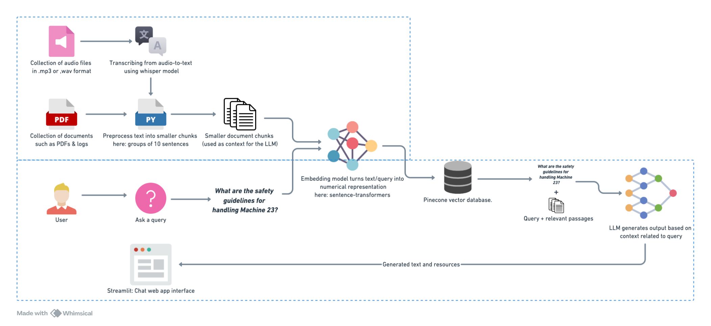

# Step-by-Step Guide for Building the RAG Pipeline

## 1. Data Preprocessing
### Overview
This document outlines the design of a Retrieval-Augmented Generation (RAG) system tailored for a Manufacturing Execution System (MES) in the chemical industry. The goal is to create a robust architecture that integrates diverse data sources, including text documents, video transcripts, logs, FAQs, and user guides, to build a comprehensive knowledge base. The system will leverage Gen-AI techniques to provide precise, contextually relevant answers to user queries.

The architecture covers the entire pipeline, from data ingestion and preprocessing to query handling and response generation. It aims to streamline information retrieval for MES users, enhancing decision-making and operational efficiency through intelligent, context-aware assistance.



### Implementation
1. **Input Data Sources**:
   - Sample public PDFs and audio files related to MSE in the chemical industry were used.

2. **Processing Audio Files**:
   - Whisper audio-to-text model was employed to transcribe audio files into text along with metadata. The metadata format includes:
     ```py
     {
         "audio_source_file": file,
         "text": text,
         "char_count": len(text),
         "word_count": len(text.split(" ")),
         "sentence_count_raw": len(text.split(". ")),
         "token_count": len(text) / 4
     }
     ```

3. **Processing PDF Files**:
   - PyMuPDF was utilized to extract text and metadata from PDFs. Metadata includes:
     ```py
     {
         "page_number": page_number,
         "page_char_count": len(text),
         "page_word_count": len(text.split(" ")),
         "page_sentence_count_raw": len(text.split(". ")),
         "page_token_count": len(text) / 4,
         "text": text
     }
     ```

4. **Text Preprocessing**:
   - Text from audio and PDFs was combined and processed into sentences using the spaCy NLP library.
   - Sentences were grouped into chunks of up to 10 sentences each, ensuring that each chunk stayed within the embedding model’s 380-token limit.
   - Each chunk will have metadata associated with it in the following format:
     ```py
     {
         "source": "pdf", # or audio, video
         "source_file": "file_path",
         "page_number": 21, # only for documents
         "token_count": len(text) / 4,
         "text": text,
     }
     ```

   - Chunks with fewer than 30 tokens were filtered out to retain only meaningful content.

## 2. Embedding Generation
### Model Selection
- The **SentenceTransformer** model `all-mpnet-base-v2` was chosen for generating embeddings, as it provides high-quality vector representations with minimal GPU load.

### Process
- Embeddings were generated for each text chunk using the following configuration:
  ```python
  embedding_model = SentenceTransformer(model_name_or_path="all-mpnet-base-v2")
  ```

## 3. Vector Indexing
### Tool
- **Pinecone** vector database was used to store and query the embeddings. It has a generous free tier and fast insert & semantic search capability.

### Implementation
- An index was created with the following specifications:
  ```python
  pc.create_index(
      name=index_name,
      dimension=768, 
      metric="cosine", # For semilarity search
      spec=ServerlessSpec(
          cloud="aws",
          region="us-east-1"
      )
  )
  ```

- Associated metadata is stored on device (We can use a relationa database like postgresql for batter scaleing).

## 4. RAG Workflow
### Input
- A user query is input to the system.

### Process
1. **Query Embedding**:
   - The user query is embedded using the same embedding model as used for the data.

2. **Retrieval**:
   - The query embedding is used to fetch the top 5 most relevant context resources from the Pinecone vector database.

3. **Context-Aware Generation**:
   - The retrieved context is combined with the user query to create a prompt.
   - The prompt is passed to the LLM (`google/gemma-2b-it`), which generates a response leveraging the provided context.

### Output
- The final response is presented to the user.

## 5. Evaluation
### Proposed Metrics
1. **Retrieval Metrics**:
   - Precision@k: Measure the relevance of the top-k retrieved contexts.
   - Recall: Evaluate how many of the relevant contexts were retrieved.

2. **Generation Metrics**:
   - BLEU/ROUGE: Compare the generated response with reference answers (if available).
   - Human Evaluation: Rate the usefulness and correctness of the response on a scale.

3. **Efficiency Metrics**:
   - Query latency: Measure the time taken to retrieve and generate a response.
   - Memory usage: Monitor resource utilization during the process.


